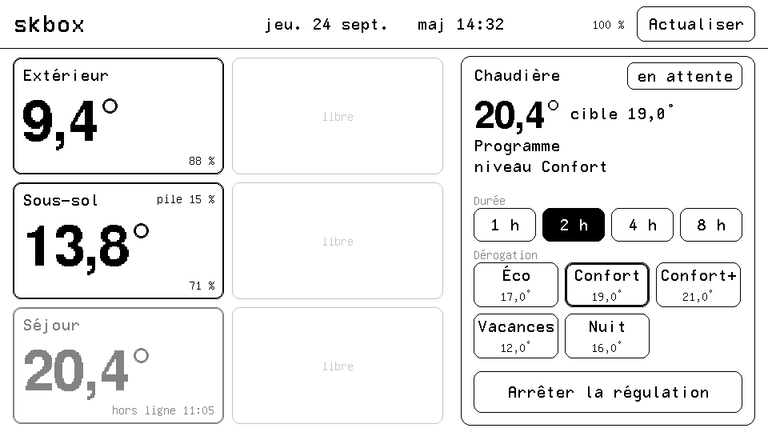

# Afficheur skbox — M5Stack PaperS3

Écran e-ink 4,7" (960×540, tactile) qui affiche les températures des capteurs et l'état de la chaudière, et permet de piloter la chaudière.

## Fonctions

Quatre pages, choisies par les onglets de l'en-tête. L'en-tête affiche aussi la date, l'heure de la dernière mise à jour, la batterie (niveau, tension, charge) et « en veille ».

- **Maison** :
  Grille de 4 colonnes × 3 cartes, remplie colonne par colonne. Libellés : 16 caractères environ par carte, au-delà ils sont tronqués par « ... ».
  - *Températures* (colonnes 1-2, `SENSOR_IDS`, 6 au plus) : actuellement Extérieur, Sous-sol et Séjour dans la 1re colonne. Un capteur hors ligne apparaît en gris avec l'heure de son dernier message. Le niveau de pile s'affiche quand il passe sous 20 %.
  - *Prises et lumières* (colonnes 3-4, `SWITCH_IDS`, 6 au plus, liste explicite : ni ventilation ni relais de chaudière) : carte noire quand c'est allumé, blanche quand c'est éteint, grise quand l'appareil est hors ligne. Un toucher sur la carte allume ou éteint (`POST /api/devices/:id/command`) ; l'état s'affiche tout de suite, puis il est relu 3 s plus tard.
- **Chaudière** (plein écran) :
  - *État* : température mesurée et cible, état du brûleur (badge *CHAUFFE* quand le brûleur est commandé, sinon « ne chauffe pas » en texte simple ; ce n'est pas un bouton), mode (*FORCÉ* / *PROGRAMME* / *DÉFAUT* / *ARRÊT*) avec le programme et le prochain changement, alerte si le relais est hors ligne.
  - *Pilotage* :
    - choisir une durée (1 h, 2 h, 4 h ou 8 h), puis toucher un niveau : `POST /api/boiler/boost` ;
    - pendant une dérogation, toucher une autre durée la prolonge ou la raccourcit tout de suite (même niveau, durée comptée à partir de maintenant) ;
    - *Annuler dérogation* : `DELETE /api/boiler/boost` ;
    - *Arrêter la régulation* : il faut toucher deux fois en moins de 5 s, puis `PUT /api/boiler/enabled`. *Reprendre la régulation* fonctionne en un seul toucher.
- **Alarme** : écran d'attente pour le futur système d'alarme.
- **Libre** : écran d'attente, réservé.
- **Sons** (buzzer intégré, volume `BEEP_VOLUME`, 0 = muet) : bip court à chaque bouton touché (un toucher hors bouton reste silencieux, pratique pour vérifier le calage) ; deux notes montantes quand skbox accepte une commande ; note grave en cas d'erreur (commande refusée, skbox ou Wi-Fi injoignable, échec d'« Actualiser »).
- **Veille** : après `IDLE_S` secondes sans toucher, le Wi-Fi est coupé et l'appareil passe en *light sleep*. L'en-tête affiche alors « en veille ». Il se réveille au toucher (ce premier toucher sert seulement à réveiller l'écran) ou toutes les `REFRESH_S` secondes pour se rafraîchir.

Les données viennent d'un seul appel : `GET /api/display/summary` (module `apps/api/src/display`).

## Installation

1. Installer [PlatformIO](https://platformio.org/) (extension VS Code ou `pip install platformio`).
2. `cp include/config.example.h include/config.h`, puis renseigner le Wi-Fi et l'URL de l'API (`http://skbox.lan.home` : sur skbox-mini l'API n'écoute qu'en local derrière nginx, et ce nom n'est résolu que par le DNS de skbox-mini, d'où `SKBOX_DNS`).
3. Brancher le PaperS3 en USB-C, compiler avec `pio run`, puis flasher avec `"$(head -1 "$(which pio)" | cut -c3-)" flash.py`. Ce script remplace `pio run -t upload` : il attend que le port USB apparaisse (il disparaît pendant la veille), désactive le chien de garde RTC qui coupait la puce au milieu de l'écriture, exige que les 4 blocs soient vérifiés, puis redémarre la puce sur le firmware (plus besoin d'éteindre et de rallumer).

Renseigner `SENSOR_IDS` avec les ids skbox des capteurs Extérieur, Sous-sol et Séjour, séparés par des virgules et dans cet ordre. Les ids sont visibles dans Swagger (`/docs`, `GET /api/devices`). Pour ajouter un capteur plus tard, il suffit d'ajouter son id : il prendra le premier emplacement libre.

## Remarques

- L'API skbox n'a pas d'authentification : le PaperS3 doit être sur le même réseau local que skbox-mini.
- Si l'appareil ne démarre pas en mode téléversement, maintenir le bouton latéral pendant le branchement.
- **Moniteur série sous macOS** : ouvrir le port (`pio device monitor` compris) active DTR/RTS, ce qui réinitialise l'ESP32-S3 en mode téléchargement (`boot:0x0 … waiting for download`). Pour relancer le firmware, éteindre/rallumer l'appareil avec le bouton latéral sans le maintenir. Les journaux `[wifi]`, `[http]`, `[veille]`… ne sont donc lisibles que si le port reste ouvert pendant ce redémarrage.
- **Diagnostic à distance** : chaque requête `GET /api/display/summary` porte, en plus de `bat`/`mv`/`chg`, `rst` (raison du dernier démarrage, `esp_reset_reason()` : 1 = mise sous tension, 3 = logiciel, 4 = plantage, 5/6/7 = chien de garde, 9 = baisse de tension), `last` (dernière étape notée en mémoire non volatile avant ce démarrage : 1 = éveillé, 2 = en veille, 3 = réveil par minuterie, 4 = réveil par toucher, 5 = attente du relâchement du tactile avant la veille), `rr` (code matériel brut du reset, ex. 1 = mise sous tension, 21 = reset par l'USB), `boot` (compteur de démarrages) et `wk` (dernier réveil : `t` minuterie, `p` toucher). Lecture : `grep ESP32HTTPClient /var/log/nginx/access.log` sur skbox-mini.

